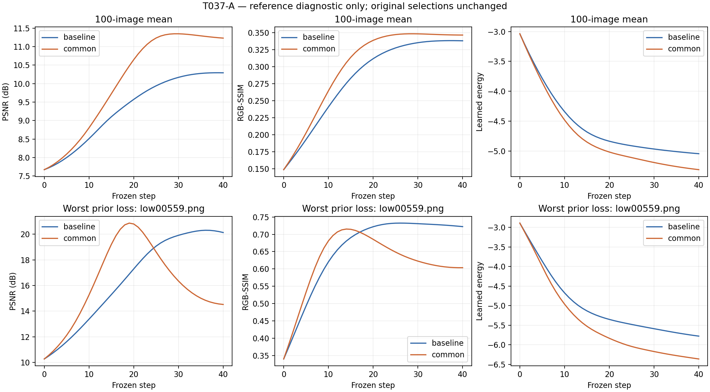

# T037-A — DONE: limited/mixed late-selection headroom

**REFERENCE_DIAGNOSTIC_ONLY.** Within the exact frozen common-gain trajectories, mean reference-best minus selected PSNR is **0.683233655119 dB**; **18/29** prior PSNR-loss images reach or exceed the baseline selected PSNR at a strictly earlier common step. The predefined joint rule is mean headroom >=0.75 dB AND at least15/29 earlier rescues. This audit does not select a deployable checkpoint or establish an early-stopping rule.

Late overshoot is visible in a subset, especially the worst prior PSNR case, but does not explain the entire tail:11/29 prior PSNR-loss images have no earlier common state reaching the baseline selected PSNR. Median PSNR headroom is only0.091785222 dB, while p95 is4.434495354 dB; the mean is driven disproportionately by a smaller tail. The worst case can recover PSNR but its best common SSIM still falls below baseline. The fixed joint criterion therefore remains unmet; neither the threshold nor the cohort is changed.

## Inputs and information boundary

Source **009823f96f987d341d16314e924d0e3cd24b3b9e**, branch `codex/T037A-late-selection`, PR [#62](https://github.com/word-ky/TTIE/pull/62), base b7872a7a after accepted T036 merge d7e615066479fb97329aec1d28df636015433dd8. Evidence SHA is in the final main mailbox/delivery receipt.

Exact T036 cohort SHA **279c74b335999d6631d436c79ea80e9e2cccfc4b97cb7c0b992829d04cfaf40b**, prior freeze **46e667ded785e4f3f8ba341d40d00a7e02ca652e2778fcc7ead1750665161be4**, prior metrics **cdbd7fec76194153db645133d5d35dd43f6f9d852ebbd6674756d77d1ad7aee0**. Reuses those same100 already-reference-used development pairs. No new cohort, official-test access, optimizer update, energy forward pass, energy/CLIP training, deployable-state mutation or stopping threshold. Original min-predicted-energy decisions and all41 energy scores are copied unchanged. Reference-best states are offline diagnostics only and must never become per-image inference inputs.

T036 retained raw-state trajectories, physical fields and200 selected output tensors, rather than all step images. The accepted renderer sources were deployed as exact accepted Git bytes and bound by127 file hashes. A6000 physicalGPU1 reconstructed all8,200 images from fixed lows, raw states and gates, with no optimizer or energy model instantiated. Every prior artifact hash was checked. All200 selected outputs are **bit-exact**, maximum absolute error **0.0**; physical-field replay max **2.384185791015625e-07**, identity max **5.960464477539063e-08**, both within the predeclared1e-6 reconstruction tolerance. Small field/identity differences reflect floating-point rendering; no selected-metric discrepancy was introduced.

Sole GPU reconstruction `20260915-055148-ttie-t037a-reconstruct`, release `20260915-055124-ttie-t037a-diagnostic`, completed in **116.683724s**, exit0. All200 complete trajectory tensors froze at **2026-09-14T21:53:51.391806+00:00**, SHA **29af8c077cdbfb94b9afda83d026a6fe7d99b7b25076d8eb7704d8f8a2fdcd0a**, before references; normal decodes0 and updates0. Evaluation `20260915-055515-ttie-t037a-evaluate` began **2026-09-14T21:55:20.719900+00:00**, first normal open **2026-09-14T21:55:21.000843+00:00**, completed **2026-09-14T21:58:11.174387+00:00**, in **170.461198s**, exit0. Every full tensor is hashed again before its reference is opened. All200 hashes are checked again for backup after scoring.

## Numerical verification

Exact accepted native full-RGB PSNR/RGB-SSIM, float32 pixels promoted to float64, no crop/resize/quantized reconstruction. Eight CPU workers reuse the accepted SciPy Gaussian-filter SSIM implementation; an independent separable-filter implementation and independent dot-product MSE replay every8,200 metric pair. Maximum metric discrepancy **9.521272659185342e-13**. All200 selected T036 PSNR/SSIM values reproduce with max error **0.0**. Original selected steps reproduce exactly, including99 common step40 and one step36. Local standard-library replay verifies all8,200 rows,100 per-image diagnostics, original energy selections, histograms, loss IDs, quantiles and curves: **10736 scalar checks**, max error **3.552713678800501e-15**. Focused tests: local2passed1.95s; server2passed0.10s.

## Headroom and rescue

| Metric | Mean headroom | Median | p05 | p95 | Positive images | Earlier-rescued prior losses | Earlier reaches baseline, all100 |
|---|---:|---:|---:|---:|---:|---:|---:|
| psnr | 0.683233655119 | 0.091785221883 | 0.000000000000 | 4.434495353723 | 72 | 18/29 | 89 |
| ssim | 0.016036952091 | 0.008304160732 | 0.000000000000 | 0.046678078389 | 81 | 28/40 | 88 |

Reference-best common-step histograms (earliest exact ties; PSNR and SSIM optimized independently):

- psnr: 0: 16, 4: 2, 9: 1, 11: 1, 12: 1, 15: 1, 19: 1, 20: 1, 21: 2, 23: 2, 24: 2, 25: 3, 26: 2, 27: 2, 28: 3, 29: 4, 30: 2, 31: 5, 32: 3, 33: 4, 34: 5, 35: 1, 36: 1, 37: 4, 38: 3, 40: 28.
- ssim: 0: 13, 1: 4, 2: 3, 3: 3, 5: 3, 8: 1, 9: 1, 10: 1, 12: 1, 14: 1, 18: 1, 19: 2, 20: 2, 21: 3, 22: 1, 23: 4, 24: 2, 25: 1, 26: 6, 27: 3, 28: 4, 29: 4, 30: 2, 31: 3, 32: 2, 33: 2, 34: 3, 35: 2, 36: 2, 39: 1, 40: 19.

## Worst prior case: low00559.png

psnr: baseline selected step40 = 20.135752913330; common selected step40 = 14.521284323945; common reference-best step19 = 20.870228500896; headroom 6.348944176950; earliest baseline-reaching common step = 17.

ssim: baseline selected step40 = 0.722143183321; common selected step40 = 0.603604270951; common reference-best step14 = 0.715125827079; headroom 0.111521556128; earliest baseline-reaching common step = None.

Full82-point worst-case trajectory is in `T037A_result/worst_case_trajectory.json`; plotted with aggregate curves below.

## Exact29 prior PSNR-loss cases

| Image | Baseline selected PSNR | Common selected PSNR | Reference-best step | Best PSNR | Headroom | Earliest earlier rescue |
|---|---:|---:|---:|---:|---:|---:|
| Train/Low/low00353.png | 12.185141558 | 11.883085060 | 9 | 12.064537829 | 0.181452770 | None |
| Train/Low/low00277.png | 9.109150346 | 9.057781775 | 0 | 9.416516429 | 0.358734653 | 0 |
| Train/Low/low00341.png | 10.845309284 | 10.728305836 | 0 | 10.931137211 | 0.202831375 | 0 |
| Train/Low/low00198.png | 19.293242918 | 17.682477765 | 26 | 20.744347867 | 3.061870103 | 23 |
| Train/Low/low00372.png | 7.864420182 | 7.065935585 | 38 | 7.066092460 | 0.000156875 | None |
| Train/Low/low00453.png | 11.668195331 | 11.641934234 | 0 | 12.320398028 | 0.678463794 | 0 |
| Train/Low/low00400.png | 7.465384944 | 6.919001879 | 0 | 7.159274110 | 0.240272232 | None |
| Train/Low/low00462.png | 9.509729813 | 9.360202299 | 32 | 9.417889772 | 0.057687473 | None |
| Train/Low/low00039.png | 19.516664775 | 19.263198738 | 25 | 25.832500457 | 6.569301719 | 19 |
| Train/Low/low00559.png | 20.135752913 | 14.521284324 | 19 | 20.870228501 | 6.348944177 | 17 |
| Train/Low/low00480.png | 8.594545954 | 8.325274115 | 20 | 8.514340918 | 0.189066803 | None |
| Train/Low/low00452.png | 8.559340936 | 8.506133512 | 40 | 8.506133512 | 0.000000000 | None |
| Train/Low/low00307.png | 7.578502495 | 7.572879360 | 0 | 8.694291706 | 1.121412345 | 0 |
| Train/Low/low00379.png | 7.489416877 | 6.645414013 | 0 | 8.330283582 | 1.684869569 | 0 |
| Train/Low/low00591.png | 10.821284802 | 9.263604574 | 4 | 15.562279719 | 6.298675145 | 0 |
| Train/Low/low00367.png | 11.495993567 | 11.452064843 | 0 | 11.895752651 | 0.443687808 | 0 |
| Train/Low/low00397.png | 6.725866702 | 6.572832336 | 0 | 7.354093972 | 0.781261636 | 0 |
| Train/Low/low00504.png | 13.446461962 | 12.791384511 | 29 | 12.822257803 | 0.030873292 | None |
| Train/Low/low00565.png | 18.700035897 | 17.091883954 | 21 | 21.372560359 | 4.280676405 | 17 |
| Train/Low/low00312.png | 11.638053950 | 11.169447010 | 21 | 11.355912114 | 0.186465104 | None |
| Train/Low/low00644.png | 20.429236254 | 14.960321960 | 12 | 22.619069194 | 7.658747234 | 10 |
| Train/Low/low00458.png | 7.894260528 | 7.857787851 | 0 | 8.303283119 | 0.445495268 | 0 |
| Train/Low/low00435.png | 9.741853064 | 9.106966338 | 31 | 9.170714717 | 0.063748379 | None |
| Train/Low/low00428.png | 10.151644857 | 9.882316656 | 40 | 9.882316656 | 0.000000000 | None |
| Train/Low/low00286.png | 9.354787121 | 9.194866687 | 26 | 9.405540003 | 0.210673316 | 22 |
| Train/Low/low00394.png | 7.992565593 | 7.525567090 | 0 | 8.724818415 | 1.199251325 | 0 |
| Train/Low/low00437.png | 9.599141596 | 9.436578749 | 33 | 9.475493096 | 0.038914346 | None |
| Train/Low/low00580.png | 17.217342722 | 16.052953264 | 23 | 20.417013996 | 4.364060732 | 18 |
| Train/Low/low00366.png | 9.099255054 | 8.904813384 | 0 | 9.479732018 | 0.574918634 | 0 |

All40 prior SSIM-loss cases and their independent SSIM rescue results are in `T037A_result/prior_loss_cases.json`; all100 per-image diagnostics in `per_image.csv`.

## All per-step aggregate curves

Each quality/energy cell is mean / median over the same100 images. Learned energies are copied from original T036 decisions, never recomputed or optimized.

| Method | Step | PSNR | RGB-SSIM | Learned energy |
|---|---:|---:|---:|---:|
| baseline | 0 | 7.670752486 / 7.521243051 | 0.148785111 / 0.124575501 | -3.038004117 / -2.921163678 |
| baseline | 1 | 7.719848860 / 7.629245089 | 0.157187366 / 0.133865173 | -3.201501088 / -3.100754499 |
| baseline | 2 | 7.777350287 / 7.698653333 | 0.165769341 / 0.142391941 | -3.357861931 / -3.288643956 |
| baseline | 3 | 7.843101594 / 7.715935586 | 0.174614959 / 0.148024016 | -3.507130325 / -3.472415090 |
| baseline | 4 | 7.916981587 / 7.745132690 | 0.183734835 / 0.158715554 | -3.649213314 / -3.626558661 |
| baseline | 5 | 7.998553441 / 7.774336683 | 0.193068326 / 0.165981063 | -3.784650836 / -3.787327886 |
| baseline | 6 | 8.087580175 / 7.795418001 | 0.202574460 / 0.167964330 | -3.913199110 / -3.942072749 |
| baseline | 7 | 8.183629471 / 7.857959993 | 0.212189849 / 0.181290032 | -4.033710725 / -4.072099924 |
| baseline | 8 | 8.286103950 / 7.936881087 | 0.221822391 / 0.182846121 | -4.145265443 / -4.200834036 |
| baseline | 9 | 8.394586805 / 8.029348187 | 0.231393148 / 0.183637431 | -4.248051515 / -4.320481539 |
| baseline | 10 | 8.509355794 / 8.158367805 | 0.240816496 / 0.193398528 | -4.342355158 / -4.412593126 |
| baseline | 11 | 8.628534409 / 8.272023244 | 0.249992388 / 0.202418094 | -4.428330038 / -4.448849678 |
| baseline | 12 | 8.750967382 / 8.342301170 | 0.258888575 / 0.209563789 | -4.505232997 / -4.538863420 |
| baseline | 13 | 8.874084834 / 8.496374203 | 0.267466339 / 0.217537270 | -4.572700362 / -4.610969067 |
| baseline | 14 | 8.992239705 / 8.590774413 | 0.275556684 / 0.229427180 | -4.631566687 / -4.674061060 |
| baseline | 15 | 9.102068459 / 8.652766095 | 0.283079037 / 0.236751313 | -4.682332947 / -4.737667084 |
| baseline | 16 | 9.204188811 / 8.737234462 | 0.289992083 / 0.240085837 | -4.724581923 / -4.792674065 |
| baseline | 17 | 9.300787491 / 8.879858403 | 0.296288047 / 0.243438086 | -4.760210946 / -4.840047121 |
| baseline | 18 | 9.394408631 / 8.913298587 | 0.301973478 / 0.250485495 | -4.789946542 / -4.874596834 |
| baseline | 19 | 9.484988638 / 8.985977403 | 0.307072895 / 0.256913610 | -4.815317252 / -4.906052113 |
| baseline | 20 | 9.572097307 / 9.150507931 | 0.311610637 / 0.262764368 | -4.836935980 / -4.930159569 |
| baseline | 21 | 9.655478322 / 9.299360114 | 0.315636761 / 0.268086590 | -4.855431087 / -4.957497358 |
| baseline | 22 | 9.734693988 / 9.380031946 | 0.319190680 / 0.272923305 | -4.871986125 / -4.983365059 |
| baseline | 23 | 9.808833715 / 9.415738954 | 0.322312986 / 0.277304503 | -4.887068775 / -5.013537407 |
| baseline | 24 | 9.876961497 / 9.455295255 | 0.325042783 / 0.280558278 | -4.900781202 / -5.031268835 |
| baseline | 25 | 9.939198315 / 9.522604862 | 0.327415965 / 0.282767707 | -4.913438971 / -5.047823668 |
| baseline | 26 | 9.995706686 / 9.559925293 | 0.329468290 / 0.284911806 | -4.925328934 / -5.065348148 |
| baseline | 27 | 10.046934037 / 9.589900472 | 0.331240439 / 0.286970609 | -4.936556256 / -5.079668999 |
| baseline | 28 | 10.092671255 / 9.610206104 | 0.332754984 / 0.290770168 | -4.947451923 / -5.088310242 |
| baseline | 29 | 10.133077932 / 9.629097752 | 0.334039750 / 0.294779394 | -4.957750220 / -5.102132320 |
| baseline | 30 | 10.168432614 / 9.645292122 | 0.335116926 / 0.296312388 | -4.967604973 / -5.113228559 |
| baseline | 31 | 10.199041059 / 9.658798001 | 0.335996777 / 0.297491591 | -4.977038875 / -5.121785402 |
| baseline | 32 | 10.224822678 / 9.669626701 | 0.336696790 / 0.298343860 | -4.986032767 / -5.133183718 |
| baseline | 33 | 10.245706158 / 9.677795634 | 0.337228556 / 0.298902600 | -4.994659100 / -5.143759727 |
| baseline | 34 | 10.262233529 / 9.683345250 | 0.337614859 / 0.299206748 | -5.003050363 / -5.154521465 |
| baseline | 35 | 10.274828316 / 9.686358577 | 0.337875794 / 0.299298496 | -5.011080215 / -5.164094925 |
| baseline | 36 | 10.283827085 / 9.686975840 | 0.338031719 / 0.299221150 | -5.018757937 / -5.169672489 |
| baseline | 37 | 10.289619427 / 9.685403152 | 0.338097721 / 0.299017313 | -5.026123080 / -5.175150871 |
| baseline | 38 | 10.292583148 / 9.681911036 | 0.338089122 / 0.298728025 | -5.033076591 / -5.180489063 |
| baseline | 39 | 10.293101739 / 9.676822243 | 0.338015840 / 0.298391763 | -5.039704154 / -5.185637474 |
| baseline | 40 | 10.291598379 / 9.670497330 | 0.337889748 / 0.298042117 | -5.045998678 / -5.191251993 |
| common | 0 | 7.670752486 / 7.521243051 | 0.148785111 / 0.124575501 | -3.038004117 / -2.921163678 |
| common | 1 | 7.732120552 / 7.637057192 | 0.158488210 / 0.135606556 | -3.211051927 / -3.114541292 |
| common | 2 | 7.805617540 / 7.726502907 | 0.168702160 / 0.143676322 | -3.379089570 / -3.324784398 |
| common | 3 | 7.889913058 / 7.729381862 | 0.179482312 / 0.153992346 | -3.541425478 / -3.498668313 |
| common | 4 | 7.985260070 / 7.825039711 | 0.190852459 / 0.166811562 | -3.698856211 / -3.679626226 |
| common | 5 | 8.091673659 / 7.822883408 | 0.202732682 / 0.167318324 | -3.850643725 / -3.872881889 |
| common | 6 | 8.209300999 / 7.860321657 | 0.214992792 / 0.180254505 | -3.995268776 / -4.038961411 |
| common | 7 | 8.338587493 / 7.971649553 | 0.227484165 / 0.186257445 | -4.131748319 / -4.184118748 |
| common | 8 | 8.480255424 / 8.147623716 | 0.240026739 / 0.194193546 | -4.258911014 / -4.323707342 |
| common | 9 | 8.634866552 / 8.356151844 | 0.252433441 / 0.207823993 | -4.376237750 / -4.409656286 |
| common | 10 | 8.801958634 / 8.556833764 | 0.264505883 / 0.216991487 | -4.482340469 / -4.487630606 |
| common | 11 | 8.978492390 / 8.705118025 | 0.276035559 / 0.224043999 | -4.577631128 / -4.574243546 |
| common | 12 | 9.159812759 / 8.806070032 | 0.286831263 / 0.237806509 | -4.662889450 / -4.649536610 |
| common | 13 | 9.344720236 / 8.915914071 | 0.296804922 / 0.250460562 | -4.736203032 / -4.719467402 |
| common | 14 | 9.534122036 / 8.957824001 | 0.305825975 / 0.261203454 | -4.798422377 / -4.790215969 |
| common | 15 | 9.725717736 / 9.203439484 | 0.313775108 / 0.265791077 | -4.851102161 / -4.854792833 |
| common | 16 | 9.917389405 / 9.303920201 | 0.320629491 / 0.269791502 | -4.895779698 / -4.928358793 |
| common | 17 | 10.107783848 / 9.323611655 | 0.326428414 / 0.276957517 | -4.933223088 / -4.972754955 |
| common | 18 | 10.295892373 / 9.374090191 | 0.331272295 / 0.284278207 | -4.965345235 / -5.008797884 |
| common | 19 | 10.476459434 / 9.463018964 | 0.335263899 / 0.291251114 | -4.993200514 / -5.052649975 |
| common | 20 | 10.646821729 / 9.563407461 | 0.338518864 / 0.296884041 | -5.018128469 / -5.077284575 |
| common | 21 | 10.803827114 / 9.644491495 | 0.341141867 / 0.301615070 | -5.039861274 / -5.099058628 |
| common | 22 | 10.943524163 / 9.693171431 | 0.343226818 / 0.305862982 | -5.059293280 / -5.118819952 |
| common | 23 | 11.062736163 / 9.792939249 | 0.344857033 / 0.308503319 | -5.077091129 / -5.137253523 |
| common | 24 | 11.159449519 / 9.967777953 | 0.346091981 / 0.311164760 | -5.094524143 / -5.155014038 |
| common | 25 | 11.233119155 / 10.212676415 | 0.346988263 / 0.313877333 | -5.111243308 / -5.172712803 |
| common | 26 | 11.285502517 / 10.381534504 | 0.347604508 / 0.316283543 | -5.128186841 / -5.191490173 |
| common | 27 | 11.319283631 / 10.492139463 | 0.347969912 / 0.318398986 | -5.144751415 / -5.214594364 |
| common | 28 | 11.338678323 / 10.538380423 | 0.348138285 / 0.320229665 | -5.161377985 / -5.237008810 |
| common | 29 | 11.346890178 / 10.577623647 | 0.348152962 / 0.321778321 | -5.177978804 / -5.258831024 |
| common | 30 | 11.347124096 / 10.610668937 | 0.348059597 / 0.323049288 | -5.193437660 / -5.279988766 |
| common | 31 | 11.341595071 / 10.637783779 | 0.347891883 / 0.324052492 | -5.208572690 / -5.293365479 |
| common | 32 | 11.332007729 / 10.691850795 | 0.347668023 / 0.325449552 | -5.222738738 / -5.306154013 |
| common | 33 | 11.319703428 / 10.711622507 | 0.347414670 / 0.326299365 | -5.236378675 / -5.324405432 |
| common | 34 | 11.305718761 / 10.726853444 | 0.347157429 / 0.325960864 | -5.249336858 / -5.341591358 |
| common | 35 | 11.291404174 / 10.738092755 | 0.346929907 / 0.325416369 | -5.261555779 / -5.357108355 |
| common | 36 | 11.277049491 / 10.745952476 | 0.346727117 / 0.324723001 | -5.273282602 / -5.375197172 |
| common | 37 | 11.263443830 / 10.751063193 | 0.346563519 / 0.323939611 | -5.284146860 / -5.390033484 |
| common | 38 | 11.250955798 / 10.755342054 | 0.346432823 / 0.323121586 | -5.294485359 / -5.403437376 |
| common | 39 | 11.239750265 / 10.775740211 | 0.346341203 / 0.322316341 | -5.303989291 / -5.415642023 |
| common | 40 | 11.230183607 / 10.783092414 | 0.346294721 / 0.321560145 | -5.313218861 / -5.426768303 |

## Commands, artifacts and deviations

`reconstruct.py --accepted <T036 audit> --manifest research_log/T036A_cohort/manifest.json --low-root <shared/t036a/low> --binding research_log/T037A_source_binding.json --out <run/artifacts/REFERENCE_DIAGNOSTIC_ONLY>` after `python -m pytest -q tests/test_t037a_diagnostic.py`; then separate `evaluate.py --accepted <T036 audit> --manifest <same manifest> --normal-root <shared/t036a/normal> --out <frozen output>`. Local `replay_scalars.py research_log/T037A_result research_log/T036A_result/audit/metrics.csv`.

The initial evaluation launch055422 had an SSH connection timeout before any remote run directory/session existed; absence was checked, then sole actual evaluation055515 launched. No reconstruction/evaluation scientific restart or retuning. The existing NVML warning did not prevent A6000 CUDA execution. No changes to accepted deployable modules. Full reconstructed floating-point frames remain under the reconstruction run and in an F archive; compact scalar evidence and source/recovery files are retained under both server roots and locally. Archive SHA256 values are in `T037A_archives.json`; recovery/delivery identifies the final Git commits.

Stop after this diagnostic. Await the research lead's review; no threshold/controller qualification is performed in this cycle. Reachable reference-best quality is diagnostic capacity, not deployable performance.

limited/mixed late-selection headroom
