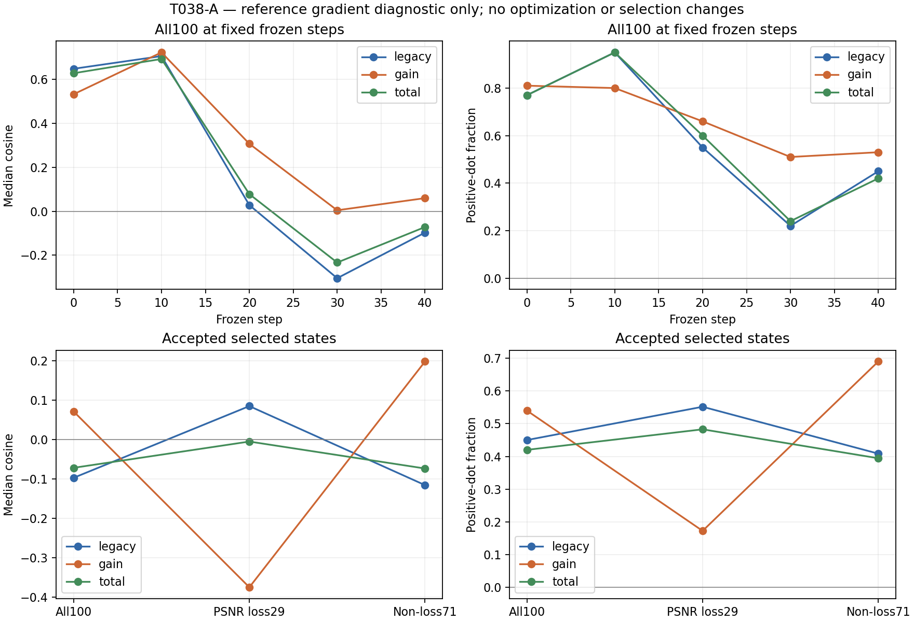

# T038-A — DONE: gain-specific mismatch supported

**REFERENCE_GRADIENT_DIAGNOSTIC_ONLY.** At the exact29 T036 PSNR-loss selected states, gain-group median cosine is **-0.375134223292**, positive-dot fraction **0.172413793103 (5/29)**, versus legacy EV+gamma **0.551724137931 (16/29)**. The difference is **37.931034483 percentage points**. All three predeclared conditions pass: gain median<=-0.25, gain positive fraction<=35%, and legacy exceeds gain by>=20 percentage points.

The association is specific to the observed loss subset, not evidence that gain is globally harmful: gain has54% positive-dot at all100 selected states and49/71=69.014% in non-loss images. Legacy alignment still collapses late (step30 median-0.304376581, positive22%), so this does not erase the shared legacy-field failure. Of the29 loss cases,13 have valid legacy but invalid gain,11 have both invalid,3 both valid, and2 invalid legacy but valid gain. This is a local raw-coordinate gradient attribution, not a causal intervention, projected-Adam update audit, or deployable repair.

## Frozen inputs and exact bindings

Source **b15a135f48d4f4b84d3a9993790ba49b8f3ab722**, branch `codex/T038A-coordinate-attribution`, PR [#63](https://github.com/word-ky/TTIE/pull/63). Base1adc37d1 after accepted T037 mergec0d84b1d3c7e6af186c28ca736d6ac2bc752d35c. Final evidence SHA is recorded in the main mailbox and delivery receipt.

Exact accepted T036 cohort **279c74b335999d6631d436c79ea80e9e2cccfc4b97cb7c0b992829d04cfaf40b**, T036 freeze **46e667ded785e4f3f8ba341d40d00a7e02ca652e2778fcc7ead1750665161be4**, prior metric CSV **cdbd7fec76194153db645133d5d35dd43f6f9d852ebbd6674756d77d1ad7aee0**. Frozen T014 Sobolev checkpoint **c3d1eef9f20af163e1268823cf16d3fdaed315e7723fc94db3b1138ad1336521**, including its accepted normalization buffers; CLIP **1bd3c7172de5b207ceac554f5ab5266166f3b9baccc9af5989bc801016d080ad**, prototypes **b4b32dbd96c65dcf606ee38d7450ebf348f5731823503b9c71ba15ec78217ac7**, gate **b7458c51466fd89c1bfa8e7c4bf1dd820ddf56e33c12c406f6625ac64361a4ce**. All129 staged source/metadata hashes and all checkpoint hashes were verified. Accepted renderer, common-gain energy features, T029 alignment/summarization and model-loading sources were staged as exact Git blobs; no deployable file was modified. Full frozen model tensor hashes are in the Stage-A freeze receipt.

Reuse only the same100 already-reference-used T036/T037 training-development pairs. Stage A does not open normals or read prior metrics/loss IDs. Reference-derived29/71 grouping is read only in Stage B after Stage-A freeze. No new cohort, official test, reference-selected state, retraining, controller or additional action coordinate. The fixed states are0,10,20,30,40 for all100 plus the one accepted selected step36: **501 audited states**. Every image contributes exactly one original selected state.

## Parity, Stage-A freeze and isolated Stage B

Before the first gradient computation, all100 selected common outputs were reconstructed and compared with accepted T036 selected tensors: **100 bit-exact, max error0**, exceeding the required<=1e-6 parity. Preflight completed **2026-09-14T22:42:11.048338+00:00**, with zero gradient calls/reference decodes. Stage A then copied each frozen raw state into the isolated accepted renderer, verified every frozen gate against low-only reconstruction, and evaluated the frozen energy. All501 low-only `g_E`, raw states, output tensors, active masks, gates and energies were saved before reference work. Features and energy values match accepted T036 exactly (max0). Maximum historical backward-vector difference **2.6226043701171875e-06** is disclosed as auxiliary floating-point backward drift under the accepted nondeterministic CUDA setting; it is not an extra equality gate or an independent scalar-replay error.

Stage A sole A6000 physicalGPU1 run **20260915-064200-ttie-t038a-stage-a**, release20260915-064136-ttie-t038a-attribution, **36.766677s**, exit0. It froze at **2026-09-14T22:42:45.127172+00:00**, SHA **a5f587691414ad0962225c43144f1746ea1dcdb4dcd239b6a15f1386b3e22ef0**. Normal decodes0, optimizer updates0, selection changes0; gradients/states/outputs all finite; raw states remained unchanged during differentiation; all energy/scorer tensors and checkpoint files remained unchanged and their `.grad` fields stayed empty.

Stage B sole A6000 physicalGPU1 run **20260915-064355-ttie-t038a-stage-b**, began **2026-09-14T22:44:01.461026+00:00**, first normal open **2026-09-14T22:44:03.126970+00:00**, completed **2026-09-14T22:44:12.395866+00:00**, **10.935047s**, exit0. All100 Stage-A file hashes and source hashes were checked before reference access. It reconstructs the same frozen state with the same renderer and computes `g_R = d mean((output.double()-normal.double())**2) / d raw`; native float32 RGB input/reference pixels, no crop/resize. Stage-B output reconstruction max error **0.0**. No optimizer or checkpoint selection is invoked. All Stage-A files retain their hashes after reference gradients and again during archive creation.

## Group and scalar definitions

The raw tensor is1x3x2x2. Each group includes only cells active in the accepted frozen gate: legacy channels0,1 (EV,gamma), gain channel2 (one post-gamma gain shared over RGB), total allthree channels. Group masks are disjoint and union to total. Per state, total dot equals legacy dot plus gain dot; medians are not additive. The exact accepted T029 routine converts gradients to float64, restricts to active coordinates, and reports dot, Euclidean norms and cosine. A norm<=1e-12 is degenerate (cosine null); positive-dot fraction uses nondegenerate rows as in T029. All reported groups here have zero degenerate/zero-gradient fractions, so fractions use the full stated row count. Valid means strictly `g_E dot g_R > 0`; its negative-energy direction is first-order restorative for MSE. Invalid means nonpositive, not a fitted threshold.

## Per-step and selected-state summaries

Every fixed-step group has100 images. Selected groups are all100, exact29 PSNR-loss, and71 non-loss. Each row reports active-coordinate values; full means/p10/p90 and zero counts are also in `stage_b/summary.json`.

| Set | Group | N | Median cosine | Positive-dot fraction | Median energy norm | Median reference norm | Median dot |
|---|---|---:|---:|---:|---:|---:|---:|
| step_0 | legacy | 100 | 0.647828231186 | 0.770000000000 | 2.50602260059 | 0.0539613004481 | 0.0651729126396 |
| step_0 | gain | 100 | 0.532122402797 | 0.810000000000 | 0.135214500421 | 0.0167366029784 | 0.000911820166769 |
| step_0 | total | 100 | 0.627617071710 | 0.770000000000 | 2.50994190494 | 0.0564414417395 | 0.066275715856 |
| step_10 | legacy | 100 | 0.705539302645 | 0.950000000000 | 1.61732891149 | 0.0612196335395 | 0.070537867519 |
| step_10 | gain | 100 | 0.722243872071 | 0.800000000000 | 0.332975529408 | 0.0230839489623 | 0.0045494113502 |
| step_10 | total | 100 | 0.692416903561 | 0.950000000000 | 1.66171791918 | 0.0656187442092 | 0.0749943387606 |
| step_20 | legacy | 100 | 0.027935700389 | 0.550000000000 | 0.690665423055 | 0.0528745032547 | 0.00123364622774 |
| step_20 | gain | 100 | 0.306787973007 | 0.660000000000 | 0.175952023398 | 0.0232682800867 | 0.0010398855421 |
| step_20 | total | 100 | 0.077917564264 | 0.600000000000 | 0.715110385151 | 0.0577409843063 | 0.00291963666903 |
| step_30 | legacy | 100 | -0.304376580776 | 0.220000000000 | 0.608617303061 | 0.0474011489626 | -0.00702550162744 |
| step_30 | gain | 100 | 0.004453692748 | 0.510000000000 | 0.130529050029 | 0.0209556705858 | 3.66333546861e-05 |
| step_30 | total | 100 | -0.233146997297 | 0.240000000000 | 0.633699748644 | 0.0515287124546 | -0.00625931300749 |
| step_40 | legacy | 100 | -0.097020898539 | 0.450000000000 | 0.378544296483 | 0.046154392096 | -0.00123315801843 |
| step_40 | gain | 100 | 0.059649275594 | 0.530000000000 | 0.110675907453 | 0.019066150399 | 0.000115911095402 |
| step_40 | total | 100 | -0.071645057855 | 0.420000000000 | 0.411769265712 | 0.0518729539138 | -0.000869539348499 |
| all_selected | legacy | 100 | -0.097020898539 | 0.450000000000 | 0.367831082331 | 0.046154392096 | -0.00123315801843 |
| all_selected | gain | 100 | 0.071449775693 | 0.540000000000 | 0.110675907453 | 0.019066150399 | 0.000115911095402 |
| all_selected | total | 100 | -0.071645057855 | 0.420000000000 | 0.407986985062 | 0.0518729539138 | -0.000869539348499 |
| loss_selected | legacy | 29 | 0.085090634812 | 0.551724137931 | 0.437397324165 | 0.0364911873388 | 0.000763157013503 |
| loss_selected | gain | 29 | -0.375134223292 | 0.172413793103 | 0.0727066382586 | 0.0112512470949 | -0.000258059468843 |
| loss_selected | total | 29 | -0.004946789135 | 0.482758620690 | 0.465258086761 | 0.03795140616 | -4.91447081586e-05 |
| nonloss_selected | legacy | 71 | -0.115635851041 | 0.408450704225 | 0.347694949448 | 0.0547307081805 | -0.00136438869777 |
| nonloss_selected | gain | 71 | 0.198468410922 | 0.690140845070 | 0.113502558368 | 0.0225077885194 | 0.000358364198624 |
| nonloss_selected | total | 71 | -0.073415600884 | 0.394366197183 | 0.366804859821 | 0.0597181856876 | -0.000872806288075 |

## Sign patterns

| Set | Legacy valid / gain valid | Legacy valid / gain invalid | Legacy invalid / gain valid | Both invalid |
|---|---:|---:|---:|---:|
| all_selected | 24 | 21 | 30 | 25 |
| loss_selected | 3 | 13 | 2 | 11 |
| nonloss_selected | 21 | 8 | 28 | 14 |
| step_0 | 67 | 10 | 14 | 9 |
| step_10 | 78 | 17 | 2 | 3 |
| step_20 | 43 | 12 | 23 | 22 |
| step_30 | 8 | 14 | 43 | 35 |
| step_40 | 24 | 21 | 29 | 26 |

## Independent replay, tests and artifacts

Independent standard-library float64 `math.fsum` dot/norm/cosine replay covers all501 states and1,503 group vectors, including the predeclared30-state subset (indices0,10,...90 at steps0,20,40). Subset max absolute error **4.440892098500626e-16**, full11334 scalar-check max **4.440892098500626e-16**, both below<=1e-6. Replay also verifies active-channel masks, original selected steps, exact loss IDs, all summaries/sign counts and classification. This is independent scalar replay from saved gradients; gradients were not rerun for this check. Local focused tests **2passed7.92s** and server **2passed1.34s** cover active disjoint groups, dot additivity, negative/degenerate cosine, and all three scientific conditions.

Full Stage-A tensors are retained under the original run and F archive: **1445928960 bytes**, SHA **b3197ce456846e7d311244161c4dc822c4477c67c6bea7f679b89b15a9bd3515**. Compact scalar evidence on both server roots and locally: **333557 bytes**, SHA **1510cdb492cf4f8a39160262228c9236048caa62746d3a767158d62fdecd4c69**; all locally fetched scalars match the archive bytes. `T038A_result/stage_a/` contains parity/freeze receipts, `stage_b/` contains501 raw/gradient/group records, summary and reference-open receipt; run commands/logs and `independent_replay.json` are retained. All working artifacts, recovery notes and the final delivery receipt are mirrored into the project-root `research_log/`.

Commands: Stage A runs `python -m pytest -q tests/test_t038a_attribution.py` then `stage_a.py --accepted <T036 audit> --manifest <T036 manifest> --assets research_log/T036A_assets.json --binding research_log/T038A_source_binding.json --low-root <T036 lows> --out <stage_a>`. Only after successful freeze, `stage_b.py --stage-a <frozen stage_a> --accepted <T036 audit> --manifest <same manifest> --low-root <same lows> --normal-root <same used normals> --out <stage_b>`. Independent local command: `replay.py research_log/T038A_result research_log/T036A_result/audit/metrics.csv`. Exact expanded commands and environment are in the retained run scripts.

No scientific or operational failures/restarts or changed parameter. The existing NVML warning is nonblocking; both stages used CUDA A6000 GPU1. Historical backward drift is disclosed above.

## T038-A-EXEC clarification received during delivery

Research-lead commit d9baaca9de3cc932b7dab06737d8e0635ace6602 was published at22:44:09 UTC while the sole Stage B was already running (it finished22:44:12). It was observed during delivery. This is a clarification of the same T038 audit, not authorization for a duplicate experiment. Its additional numerical replay limits pass on the original frozen receipt: feature0<=1e-6, energy0<=1e-6, historical-gradient2.6226043701171875e-6<=1e-5. No material replay mismatch occurred.

The independent standard-library verifier had already been authored before Stage B and contains no imports/calls of T038/T029 alignment, summarize or classify helpers. The follow-up additionally reconstructs every coordinate mask from a hash-bound export of the frozen Stage-A gate, then replays all501 states and the exact classification independently; maximum error remains4.440892098500626e-16. The gate export reads saved tensors only and opens no image. A single Stage-B entry check now enforces the newly specified replay limits with `BLOCKED_REPLAY_MISMATCH` before reference opening; focused tests cover the actual passing receipt and each failing limit (3passed4.75s locally). This check was added after the completed run, so it is not represented as having executed retroactively. Actual GPU execution remains bound to sourceb15a135f; its original source-binding receipt is preserved. No new gradient, reference evaluation, optimizer run or selection was performed in response to the clarification.

Stop after this attribution audit and await research-lead review. Do not retrain, add a stopping rule, alter gain bounds or consume fresh/test data in this cycle.

gain-specific mismatch supported
