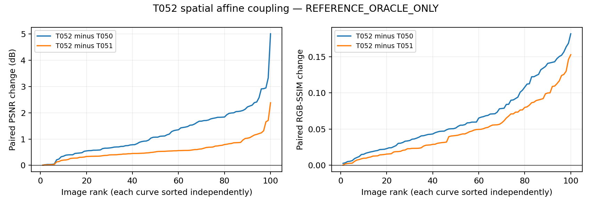

# T052-A / T052-A-EXEC PARTIAL — spatial affine coupling

REFERENCE_ORACLE_ONLY. Zero deployable changes; zero official-test access.

Concurrent research-lead update: b577bd0b1399550302e9e58b806aef02a60a4867 (17:44:24+08) created T052-A-EXEC, accepting exactscientificsourcee3bbf12c and freezing allsettings but prohibiting postauthorization source edits. It was first read during publication after the verifier-only repair and corrected replay were already completed. The sole scientifictrajectory and metrics used exactauthorizedsource and froze17:42:11+08, beforethisupdate. Originalreplayfailed; correctedverifierpassedwithouttoleranceortrajectorychanges. Because the new no-source-edit condition encompasses that verifier correction, delivery is PARTIAL pending explicit research-lead acceptance of the repaired verifier. No further source edits/reruns. Negative numericgateclassification remains not supported under fixed probe. This joint-family probe cannot isolate scale/offset interaction from the additional exposure optimization; no u-onlycontrol is authorized.

not supported under fixed probe

| Method | PSNR mean | PSNR median | RGB-SSIM mean | RGB-SSIM median |
|---|---:|---:|---:|---:|
| T050 | 21.874262727355 | 22.647607082917 | 0.505160717504 | 0.540449382935 |
| T051 | 22.533267888905 | 23.265271057274 | 0.521992520232 | 0.554501897674 |
| T052 | 23.107151128412 | 23.898237791110 | 0.570040189740 | 0.609293704864 |

Total paired changes vs T050: `{"total_psnr": {"mean": 1.2328884010566776, "median": 1.0713880420636315}, "total_ssim": {"mean": 0.0648794722359301, "median": 0.05250892734056613}}`. Sole gate: total mean PSNR >=1.50dB AND total median >=0.75dB AND total mean SSIM >=0.

Incremental paired changes vs T051: `{"delta_psnr": {"mean": 0.5738832395071441, "median": 0.5183313282504312}, "delta_ssim": {"mean": 0.048047669508238355, "median": 0.04120285231483939}}`; descriptive only, no second gate.

Win/equal/loss vs T050: `{"psnr": {"win": 100, "equal": 0, "loss": 0}, "ssim": {"win": 100, "equal": 0, "loss": 0}}`; vs T051: `{"psnr": {"win": 100, "equal": 0, "loss": 0}, "ssim": {"win": 99, "equal": 0, "loss": 1}}`.

## Fixed protocol and provenance

Tested source e3bbf12c701d642a215afc049ca05cf9017feed1, branch codex/T052A-spatial-affine, exact accepted T051 base78d24ef2365ec2a8b3e18036a9154ec9f833e9d9. T051 freeze d66edca57c6cac1ffe15a428552c73e2e343363165a2808f16a1b01cce460667, pairs ecc607ac2c04a21d5ad53c06264f22869e0ee3f65810c22d952b5bbec665be2f. T050 pairs2f3cf008677427fec0a1be0202e63272b1cd6d275957f295972161ec237716d1 are embedded in hash-bound T051 pairs. Cohort b88c8347005984b5523b117b52c0c068672fe172eb7c9aa5b60102d350e2d85b. All74 source bindings in T052A_source_binding.json verified exact committed bytes before deployment and persisted in preflight/config.

Reuse accepted T051 frozen regional affine/tone renderer, loaders, metric convention and hard gate. Only u+b[1,1,8,8] trainable. u initializes at accepted selectedT051u; b exactlyzero. e=2tanh(u), then bilinear align_corners=False; physicalb bilinear independently. Apply clamp(z_affine*2**e+b,0,1) before frozen8segmenttone and hardgate. Original low outside active mask. Every preT051 EV/gamma/common gain/lift/q is bitexactfrozen. OnefreshAdam withu lr.05,b lr.01; projectbcontrols[-.2,.2] after each update. Exactly500updates,501states,one start,earlieststrictfullRGBMSEminimum. Float32renderer/float64loss;A6000GPU1,TF32off,seed7,threads1.

All100 low-only T051 reconstructions completed 2026-09-16T09:31:19.498129+00:00; max error 0.0; bitexact True; normal decodes0. First normal decode 2026-09-16T09:32:05.725859+00:00. All100 outputs frozen 2026-09-16T09:42:10.699663+00:00 SHA83ebd03b57e4c5e43191194bc66d507f56090ed593d9681d140ffa29b4e3baa8, before first evaluation decode 2026-09-16T09:43:02.120217+00:00.

Runs/commands/envs/logs: `{"release": "20260916-173030-ttie-t052a-spatial-affine", "preflight_run": "20260916-173103-ttie-t052a-preflight", "oracle_run": "20260916-173158-ttie-t052a-oracle", "evaluation_run": "20260916-174254-ttie-t052a-eval", "replay_run": "20260916-174546-ttie-t052a-replay"}`.

Baseline2tests22.14s; focusedplusaffected5tests18.91s local /2.44s server PASS; compilePASS. Preflight 5.291453s, oracle 604.232051s. Preflight/oracle exit0. Initial evaluation produced metrics then replay failed on coordinate rounding; standalone corrected replay exit0.

## Diagnostics and independent replay

EV selected active-pixel distribution: `{"active_pixels": 23520000, "min": -1.9999723434448242, "max": 1.340335488319397, "mean": -0.38848144469656204, "median": -0.26132895052433014, "lower_hits": 0, "upper_hits": 0}`.

Offset selected active-pixel distribution: `{"count": 23520000, "min": -0.20000000298023224, "max": 0.20000000298023224, "mean": 0.07315867139188265, "median": 0.061045968905091286, "lower_hits": 7525, "upper_hits": 2108014}`.

All6400 selected physicalb controls: `{"count": 6400, "min": -0.20000000298023224, "max": 0.20000000298023224, "mean": 0.07245415040372734, "median": 0.06001396290957928, "lower_hits": 82, "upper_hits": 1541}`. Bound hits use exact float32 physical bounds; field statistics include active pixels only.

Best-step histogram: `{"493": 2, "465": 1, "500": 32, "266": 1, "433": 1, "491": 2, "182": 1, "380": 1, "490": 1, "410": 1, "327": 1, "498": 6, "462": 2, "466": 1, "499": 5, "260": 1, "443": 2, "497": 4, "474": 2, "395": 1, "371": 1, "496": 2, "329": 1, "495": 2, "214": 1, "206": 1, "318": 1, "494": 2, "475": 1, "307": 1, "484": 1, "336": 1, "233": 1, "459": 1, "330": 1, "488": 2, "425": 1, "470": 1, "225": 1, "487": 1, "438": 1, "468": 1, "486": 1, "464": 1, "211": 1, "256": 1, "397": 1, "452": 1}`; at500: 32/100.

`{"status": "PASS", "images": 100, "history_states": 50100, "selected_output_metrics": 200, "scalar_checks": 1132, "max_abs_error": 3.552713678800501e-15, "independent_renderer_max_abs": 9.5367431640625e-07, "independent_interpolation_max_abs": 3.5762786865234375e-07, "all_old_coordinates_exact": true, "inactive_outputs_exact": true, "preflight_before_normals": true, "freeze_before_metrics": true, "classification": "not supported under fixed probe", "seconds": 44.784898663987406}`

Independent NumPy half-pixel interpolation with single-rounding source coordinates checks selectedEV and additive fields separately. After field verification, use saved exact fields to isolate float32 rounding in the independently reconstructed affine/NumPy tone renderer. Check all50100joint histories for finite values, bprojection bounds, exactacceptedustarts/zero bstarts and earliest minima; all preT051 coordinates exact; inactiveoutputsoriginal; output/hash integrity;200selectedmetrics, both total/incrementalpaired metrics and all summaries. Renderer/interpolation tolerance1e-6; scalar1e-10.

## Failures, limits and delivery

Initial baseline pytest ran from outercwd and failed collection (ttie.gamma_range_box import); corrected cwd/PYTHONPATH and passed unmodifiedbaseline before edits. No scientific run failure, settings change, sweep, or retry. Initial replay failed because separately rounded NumPy source coordinates differ from CUDA single-rounding multiply-add: max1.1920928955e-6 on saved fields. The corrected verifier emulates single-rounding coordinates using a float64 multiply/subtract then float32 cast; all100field diagnosis max3.5762786865e-7. Tolerance remains1e-6, frozen trajectories/metrics unchanged. Original tested source binding retained separately; current binding points to corrected verifier. Existing NVML warning is nonblocking; CUDA computations execute onA6000.

Reference-only finite-budget development capacity, not deployable restoration, heldoutSOTA or a certifiedglobalceiling. No oracle target/gradient/state/metric may enter deployableTTT. No officialtest, retraining, baseline rerun or T053.

PR77 is based on research-authorized acceptedT051head; PR76 remains unmerged after PR75squash. Dependencies preserved, no rebase/selfmerge. Await research-lead integration/review.

Archives: `{"all_output_history_hashes_unchanged": true, "source_bindings_unchanged": true, "full": {"path": "/media/wenchang/F/wjq/TTIE/shared/t052a/T052A_full.tar", "bytes": 507719680, "sha256": "3dd281208099a64413fb70898e769aeb6a1cfc4ab123cdd98ff66602b6972cce"}, "compact": {"path": "/home/wenchang/asdasdsad/wjq/TTIE/shared/t052a/T052A_compact.tar.gz", "bytes": 20353551, "sha256": "3342e0dafde33f98f7d1ef0f7b49124ac6506f131999de137a1f23a1a087fe4c"}, "compact_backup": "/media/wenchang/F/wjq/TTIE/shared/t052a/T052A_compact.tar.gz"}`. FullimagesremoteF; compacthistories/receipts/plots stored projectlocally.

Exposure control-grid diagnostics: `{"raw_u": {"count": 6400, "min": -5.941775321960449, "max": 0.8145485520362854, "mean": -0.3645020302171049, "median": -0.12232993543148041}, "physical_ev": {"count": 6400, "min": -1.9999723434448242, "max": 1.3441836833953857, "mean": -0.3836988514307009, "median": -0.2434467226266861, "lower_hits": 0, "upper_hits": 0}, "arithmetic": "Selected raw u controls from frozen histories; descriptive physical controls computed as float32 torch CPU 2*tanh(u). No image decode, selection change or experiment rerun."}`.
