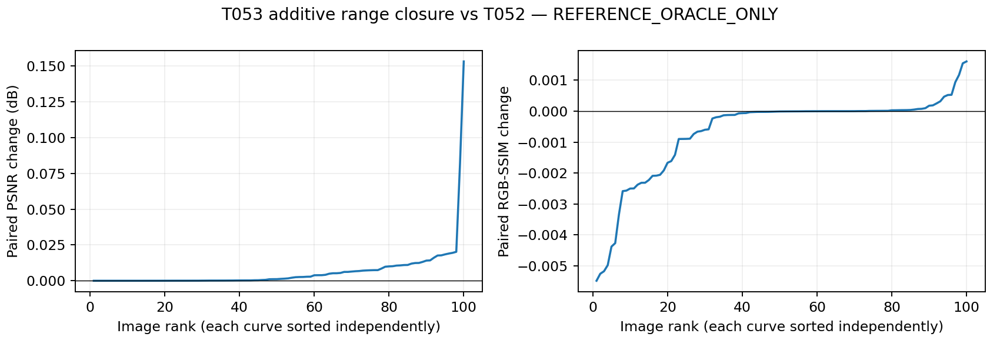

# T053-A DONE — fixed additive-range closure

REFERENCE_ORACLE_ONLY. Zero deployable changes; zero official-test access.

not supported under fixed range-closure probe

| Metric | T052 mean | T053 mean | T052 median | T053 median |
|---|---:|---:|---:|---:|
| psnr | 23.107151128412 | 23.113722803801 | 23.898237791110 | 23.898419104719 |
| ssim | 0.570040189740 | 0.569388477824 | 0.609293704864 | 0.609311687381 |

Paired changes: `{"delta_psnr": {"mean": 0.006571675389215219, "median": 0.0012221698770922274}, "delta_ssim": {"mean": -0.0006517119156778284, "median": -9.23475125247375e-06}}`. Sole gate: meanPSNR>=.50dB AND medianPSNR>=.25dB AND meanSSIM>=0.

Win/equal/loss: `{"psnr": {"win": 100, "equal": 0, "loss": 0}, "ssim": {"win": 37, "equal": 0, "loss": 63}}`.

## Fixed experiment and provenance

Scientific source d21b67c503af085e378af00efd44cb0634ad25fc; branchcodex/T053A-additive-range; base2433dd70db158d50b7728e4750d33f81b0a95141. Accepted T052 scientific sourcedeployment e3bbf12c701d642a215afc049ca05cf9017feed1, evidence86dde41c3b795b78217172583e64b6ab3f2b2d50. T052 freeze83ebd03b57e4c5e43191194bc66d507f56090ed593d9681d140ffa29b4e3baa8; pairsb0c571e305f28e30b4acbe9b1dc0e7d3b06b5fc577f266fcf5d42641368555ff; configf3e4a3b7e3c0b9225b1fa2a673c6b1088b4a2fd3cfd03827f1957d2a60408522. Cohortb88c8347005984b5523b117b52c0c068672fe172eb7c9aa5b60102d350e2d85b. T053A_source_binding.json contains80 exactsourcehashes verified beforedeployment andpersistedinpreflight/config. The accepted single-rounding verifier is included in this tested T053 manifest; no post-run verifier change.

ReuseT052renderer; exactselectedu+bstarts. Convertu toimmutablebuffer; allpreT052rawEV/gamma/gain/lift/q andhardgate frozen. Onlyb[1,1,8,8] trainable. RGBsharedphysicalcontrols bilinearalign_corners=False; fixedexposuree=bilinear(2tanh(u)); clamp(z_affine*2**e+b,0,1) thenfrozentone/hardgate, original lowoutsideactive. FreshAdam.01, bprojection[-.4,.4]aftereachupdate, exactly500updates/oneacceptedstart/501states; earlieststrictfullRGBMSEminimum. Float32renderer/float64loss;A6000GPU1,seed7,TF32off,threads1.

All100 low-only T052 reconstruction completed2026-09-16T11:00:30.794307+00:00, maxerror0.0, bitexactTrue, normals0, preflightSHA19825fb7d49d2a9c19c05a12ed37a9c56d77544ad4bbac904704509ebc0c7b9c. Firstnormal2026-09-16T11:01:29.616321+00:00; all100selectedoutputs frozen2026-09-16T11:06:19.654054+00:00 SHA5062601afc103a10da779d5153fe19885eb252a5b87d6d05cadbd19eb5876dc1 beforefirstmetricdecode2026-09-16T11:07:14.349837+00:00.

Exactcommands/envs/logs in resultpack. Runs: `{"release": "20260916-185445-ttie-t053a-range", "preflight_run": "20260916-185805-ttie-t053a-preflight", "oracle_run": "20260916-190122-ttie-t053a-oracle", "evaluation_run": "20260916-190707-ttie-t053a-eval"}`.

Tests: unchangedbaseline3passed30.51s; localfocused+affected5passed19.55s;server5passed2.49s;compilePASS. All100preflight3.401622s; oracle288.976025s. Preflight/oracle/evaluation/replayexit0.

## Starting and selected additive distributions

Physicalcontrol distributions cover all6400controls. Full-resolution field distributions cover23520000activepixels, where the correction is applied. Exact hits are equality to float32 +/-0.20 and +/-0.40, not counts exceeding the oldbound.

starting_controls: `{"count": 6400, "min": -0.20000000298023224, "max": 0.20000000298023224, "mean": 0.07245415040372734, "median": 0.06001396290957928, "exact_hits": {"-0.4": 0, "-0.2": 82, "0.2": 1541, "0.4": 0}}`.

selected_controls: `{"count": 6400, "min": -0.4000000059604645, "max": 0.31997445225715637, "mean": 0.07352910777588689, "median": 0.059387316927313805, "exact_hits": {"-0.4": 1, "-0.2": 0, "0.2": 0, "0.4": 0}}`.

starting_field: `{"count": 23520000, "min": -0.20000000298023224, "max": 0.20000000298023224, "mean": 0.07315867139188265, "median": 0.061045968905091286, "exact_hits": {"-0.4": 0, "-0.2": 7525, "0.2": 2108014, "0.4": 0}}`.

selected_field: `{"count": 23520000, "min": -0.39609989523887634, "max": 0.31849437952041626, "mean": 0.07423669322533782, "median": 0.061082253232598305, "exact_hits": {"-0.4": 0, "-0.2": 0, "0.2": 1, "0.4": 0}}`.

Beststep histogram: `{"154": 2, "197": 2, "138": 1, "173": 1, "320": 1, "275": 2, "167": 1, "367": 1, "160": 1, "150": 2, "221": 1, "190": 1, "222": 1, "426": 1, "225": 1, "263": 1, "209": 3, "163": 1, "214": 2, "126": 1, "213": 1, "153": 2, "198": 1, "161": 1, "191": 2, "152": 1, "193": 1, "257": 1, "181": 1, "246": 1, "178": 2, "158": 1, "350": 1, "186": 1, "219": 2, "122": 1, "287": 1, "120": 1, "182": 2, "185": 1, "267": 1, "144": 2, "252": 1, "171": 1, "157": 1, "133": 1, "180": 2, "224": 1, "207": 1, "278": 1, "244": 1, "215": 2, "172": 2, "339": 1, "231": 1, "162": 1, "166": 1, "254": 1, "408": 1, "248": 1, "145": 1, "229": 1, "143": 1, "184": 1, "174": 1, "218": 1, "235": 1, "125": 1, "149": 1, "118": 1, "326": 1, "200": 1, "132": 1, "141": 1, "315": 1, "177": 2, "176": 1, "309": 1, "188": 1, "136": 1, "189": 1, "192": 1, "288": 1}`; at500: 0/100.

## Independent replay and limits

`{"status": "PASS", "images": 100, "history_states": 50100, "selected_output_metrics": 200, "scalar_checks": 728, "max_abs_error": 3.552713678800501e-15, "independent_renderer_max_abs": 9.5367431640625e-07, "independent_interpolation_max_abs": 3.5762786865234375e-07, "all_old_coordinates_exact": true, "inactive_outputs_exact": true, "preflight_before_normals": true, "freeze_before_metrics": true, "classification": "not supported under fixed range-closure probe", "seconds": 42.205571118043736}`

Independent NumPy single-rounding half-pixel interpolation checks frozenexposure plusstarting/selectedadditivefields. Savedexactfields are used only afterinterpolationverification forfloat32renderer reconstruction with independentaffine/NumPytone arithmetic. Check all50100bstates finite/bounds/exactacceptedstarts/earliestminima; u/raw/lift/q/knots/evbitexact; inactiveoutputsoriginal; frozenfilehashes;200metrics; allpaireddeltas/distributions/summaries. Renderer/interpolation1e-6 andscalar1e-10tolerances unchanged.

Failures/infrastructure deviations: `["Intermittent SSH255 interrupted initial deployment before archive, then extraction and symlink updates. Resumed identical uploaded185445archive; all80sourcehashes verified before switching current.", "Preflight startup SSH255 before any job existed. Verified no run directory or tmux jobs, restored identical standard workflow run.sh/meta under same185805runId in one supported SSH call and launched once."]`. ExistingNVMLandprotobufwarningsnonblocking. No scientificfailure, settingschange, sweep, or experimentrestart.

Reference-only finite-budget development diagnostic, not deployable performance, heldoutSOTA or a certifiedoptimum. No target/oraclegradient/state/metric enters deployableTTT. No newcohort, baseline rerun or officialtest. AcceptedT052dependency retained without PRhistorycleanup/selfmerge.

Archives: `{"all_output_history_hashes_unchanged": true, "source_bindings_unchanged": true, "full": {"path": "/media/wenchang/F/wjq/TTIE/shared/t053a/T053A_full.tar", "bytes": 494940160, "sha256": "77791222b48fce26d612eb4d751aa282a91493806e0207c3028a6e3966aa18d0"}, "compact": {"path": "/home/wenchang/asdasdsad/wjq/TTIE/shared/t053a/T053A_compact.tar.gz", "bytes": 10654042, "sha256": "bee17c408f88a55107d36ab0dbb4cdba6a8616ee6569b78fb536e78f3f6f2f28"}, "compact_backup": "/media/wenchang/F/wjq/TTIE/shared/t053a/T053A_compact.tar.gz"}`. FulloutputsremoteF, compacthistories/plots/receiptsprojectlocal.

Await research-lead review; no bound/LR/budget sweep or T054.
