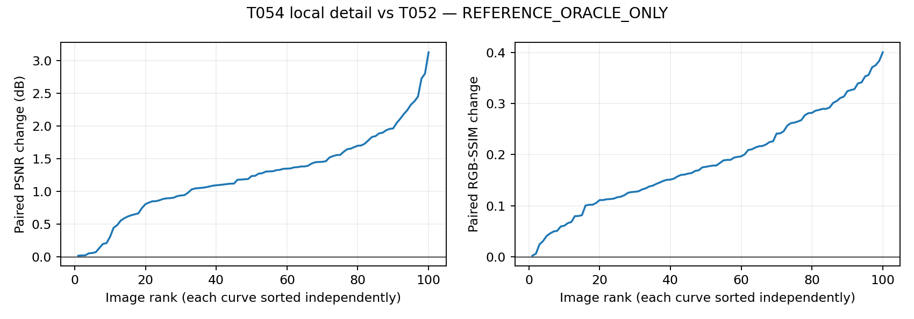

# T054-A DONE — fixed local-detail probe

REFERENCE_ORACLE_ONLY. Zero deployable changes; zero official-test access.

local-detail capacity supported

| Metric | T052 mean | T054 mean | T052 median | T054 median |
|---|---:|---:|---:|---:|
| psnr | 23.107151128412 | 24.345486740890 | 23.898237791110 | 24.810761905858 |
| ssim | 0.570040189740 | 0.757757239115 | 0.609293704864 | 0.776655515255 |

Paired deltas: `{"delta_psnr": {"mean": 1.2383356124774059, "median": 1.2353359818727352}, "delta_ssim": {"mean": 0.1877170493748716, "median": 0.17671724632549995}}`. Sole gate: mean PSNR >= .50 dB, median >= .25 dB, and mean RGB-SSIM >= .020.

Win/equal/loss: `{"psnr": {"win": 100, "equal": 0, "loss": 0}, "ssim": {"win": 100, "equal": 0, "loss": 0}}`.

## Fixed experiment and provenance

Tested source f4baa579e4441a6edf5ec818ddca87f28f1b7e5d; base2433dd70db158d50b7728e4750d33f81b0a95141; branch codex/T054A-local-detail. Accepted T052 source e3bbf12c701d642a215afc049ca05cf9017feed1 / evidence86dde41c3b795b78217172583e64b6ab3f2b2d50. No T053 states imported. T052 freeze83ebd03b57e4c5e43191194bc66d507f56090ed593d9681d140ffa29b4e3baa8; pairsb0c571e305f28e30b4acbe9b1dc0e7d3b06b5fc577f266fcf5d42641368555ff; configf3e4a3b7e3c0b9225b1fa2a673c6b1088b4a2fd3cfd03827f1957d2a60408522. Cohortb88c8347005984b5523b117b52c0c068672fe172eb7c9aa5b60102d350e2d85b. T054A_source_binding.json binds80 exact Git blobs, persisted unchanged in preflight/config.

Frozen T052 output y0; D=y0-B(y0). B applies [1,4,6,4,1]/16 horizontally then vertically, reflect padding two pixels, independent RGB, fixed float32 weighted slice sums. Analytic tests: RGB impulse gives outer-product kernel, constant image preserved exactly, reflected boundary ramp gives 3/64 at left edge. Detail basis is checked against analytic impulse residual.

Only raw v[1,1,8,8] is trainable, zero initialized. c=tanh(bilinear(v, align_corners=False)); interpolation BEFORE tanh follows the raw-grid field wording and is explicitly tested against the alternative order. Selected controls are tanh(v_grid) for description. y=clamp(y0+cD,0,1) on frozen active mask, y0 exactly on inactive pixels. Fresh Adam .05, exactly500 updates, one zero start, states0..500 and earliest strict MSE minimum. Float32 renderer / float64 full-RGB MSE. All prior raw/lift/q/u/b/knots/EV and hard gate frozen; y0/D buffers immutable. A6000 GPU1, TF32off, threads1.

All100 low-only reconstructions completed 2026-09-16T12:03:33.013450+00:00, max error 0.0, all bit-exact True, normal decodes0. Preflight SHA8a41fc421a313cba7363d4267fd878122321e8abac17045e8b81fd077dd356a4. First reference 2026-09-16T12:04:37.753956+00:00; all100 selected outputs frozen 2026-09-16T12:06:48.874844+00:00 SHAd9130a48a8959b0ef77715bfb1f1fd22d61b19000b9994f62dab96fa9ec83c55; first metric decode 2026-09-16T12:07:55.210125+00:00.

Runs: `{"release": "20260916-200256-ttie-t054a-detail", "preflight_run": "20260916-200318-ttie-t054a-preflight", "oracle_run": "20260916-200429-ttie-t054a-oracle", "evaluation_run": "20260916-200748-ttie-t054a-eval"}`. Exact commands/env/logs in compact result pack.

Tests: baseline3passed17.56s, localfocused+affected6passed13.85s, server6passed2.46s. CompilePASS. Preflight4.040311861s; oracle128.106469605s. All jobs exit0.

## Selected coefficient distributions

Controls include all6400 grid values after tanh; full field includes all24000000 pixels, including inactive locations where coefficients are ignored. Exact ±1 hits use float32 equality.

selected_controls: `{"count": 6400, "min": -0.9999998807907104, "max": 0.9998723268508911, "mean": -0.7532879280111752, "median": -0.9395946562290192, "exact_hits": {"-1.0": 0, "1.0": 0}}`.

selected_field: `{"count": 24000000, "min": -0.9999998807907104, "max": 0.9998697638511658, "mean": -0.7858675457784365, "median": -0.9391513168811798, "exact_hits": {"-1.0": 0, "1.0": 0}}`.

Best-step histogram: `{"500": 100}`; step500: 100/100.

## Independent replay

`{"status": "PASS", "images": 100, "history_states": 50100, "selected_output_metrics": 200, "scalar_checks": 720, "max_abs_error": 3.552713678800501e-15, "independent_renderer_max_abs": 0.0, "independent_basis_max_abs": 1.771841198205948e-07, "independent_interpolation_max_abs": 4.470348358154297e-07, "all_old_coordinates_exact": true, "inactive_outputs_exact": true, "preflight_before_normals": true, "freeze_before_metrics": true, "classification": "local-detail capacity supported", "seconds": 26.504553918959573}`

NumPy/SciPy verifier independently reconstructs blur with float64 convolve1d mirror padding, raw-grid half-pixel interpolation with accepted single-rounding coordinates, tanh coefficient, and float32 renderer. Saved exact c/D are used only after independent basis/interpolation checks to isolate final renderer rounding. Accepted fixed y0 is hash-verified; the preceding all100 low-only preflight reconstructs the complete T052 renderer. All50100 states checked for shape/finite/zero initialization, earliest selection and unchanged older coordinates;200 metrics recomputed independently. Tolerances unchanged: basis/interpolation/renderer1e-6, scalar1e-10.

Failures/deviations: `["Read-only preflight log fetch SSH255 once; job not restarted."]`. No scientific changes or reruns. Existing NVML/protobuf warnings are nonblocking.

This is a finite-budget development reference capacity diagnostic, not deployable TTT, held-out SOTA or a certified optimum. No target/gradient/state/metric enters deployable TTT; official test remains sealed. Accepted unmerged T052 history retained as instructed.

Archives: `{"all_output_history_hashes_unchanged": true, "source_bindings_unchanged": true, "full": {"path": "/media/wenchang/F/wjq/TTIE/shared/t054a/T054A_full.tar", "bytes": 1071093760, "sha256": "85562949d1fcd9b971868c61c1a7802b6f7d8a06e963cee89a4aed70b91e1995"}, "compact": {"path": "/home/wenchang/asdasdsad/wjq/TTIE/shared/t054a/T054A_compact.tar.gz", "bytes": 11411022, "sha256": "e5f1b22eacf78b0c10deddfcc5d3253b10db7b92276c13983f7bf0c84462ed2d"}, "compact_backup": "/media/wenchang/F/wjq/TTIE/shared/t054a/T054A_compact.tar.gz"}`. Full selected outputs remain remote/F; compact histories and evidence are project-local.

Stop after delivery; await research-lead review/new explicit OPEN. Do not repeat T054 while OPEN or start T055.
