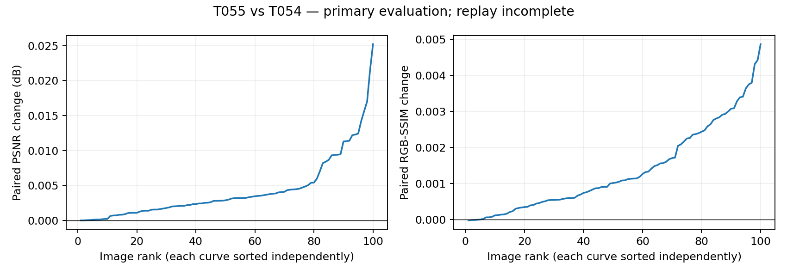

# T055-A PARTIAL — fixed local-detail convergence extension

REFERENCE_ORACLE_ONLY. Zero deployable changes; zero official-test access.

Primary-evaluator numeric verdict (not fully independently verified): material local-detail underconvergence not supported under fixed extension

| Metric | T054 mean | T055 mean | T054 median | T055 median |
|---|---:|---:|---:|---:|
| psnr | 24.345486740890 | 24.349792215572 | 24.810761905858 | 24.813333145194 |
| ssim | 0.757757239115 | 0.759127904630 | 0.776655515255 | 0.777913353031 |

Paired deltas: `{"delta_psnr": {"mean": 0.004305474682432848, "median": 0.002918943444738531}, "delta_ssim": {"mean": 0.0013706655157820719, "median": 0.001023847147050172}}`. Sole gate: paired mean PSNR>=.25dB AND median>=.10dB AND mean RGB-SSIM>=.010.

Win/equal/loss: `{"psnr": {"win": 100, "equal": 0, "loss": 0}, "ssim": {"win": 96, "equal": 0, "loss": 4}}`.

## Exact provenance and continuation

Tested source e6a79d80740307fbea3b4391a9e9f9a718f14e89; branch codex/T055A-detail-extension; accepted T054 source f4baa579e4441a6edf5ec818ddca87f28f1b7e5d / evidence a4d37006cbce1814290fc279bc0b6ae72e0dd952; base4564c24b9712fd3fac43f56542c5dc863e228923. Accepted T054 freeze d9130a48a8959b0ef77715bfb1f1fd22d61b19000b9994f62dab96fa9ec83c55, pairs34c7752f8d415c982728ec58a85906c5186b3367a516f1d76957a8c239a96d5e, config92eca9a29cb97c01a4644c0a3881235cc8172fb6de4ef1a6f6ebe102fad9c0e2. Cohortb88c8347005984b5523b117b52c0c068672fe172eb7c9aa5b60102d350e2d85b. All86 exact Gitblob source bindings in T055A_source_binding.json match preflight/config; no post-run scientific edits.

Directly reuse accepted T054 Detail/blur code. Entire T052 renderer and old raw/lift/q/u/b/knots/EV/mask/y0/D buffers unchanged. D=y0-B(y0), fixed separable horizontal then vertical [1,4,6,4,1]/16 float32 sum, two-pixel reflect padding, independent RGB. Only v[1,1,8,8] continues from exact accepted T054 selected state; c=tanh(bilinear(rawv,align_corners=False)), range[-1,1]. Render clamp(y0+cD) on active pixels; inactive exactlyy0. Fresh Adam .05, exactly1000 additional updates, one accepted start, states0..1000, earliest strict full-RGB float64 MSE through float32 renderer. Every buffer checked unchanged after optimization. GPU1 A6000, TF32off, threads1.

Preflight all100 maxerror0.0, allbitexactTrue, normaldecodes0; completed2026-09-16T12:52:31.613511+00:00, SHAfbd55327ab55b89b71c7ee8d7871543bc8eb028d5191e67ba9350449d254495e. Reconstructed y0/detail, old coords and coefficient exactly accepted; active mask independently reconstructed from gate and hashed. vs.pt SHA987e05709a2aa3857c1fc40ed35d318d82e2d84bce84bc3db76e7cbed4e60bb4 binds exact selected v; every continuation history state0 equals both this start and accepted output state.

First reference decode2026-09-16T12:53:15.726785+00:00; all100 outputs freeze2026-09-16T12:57:38.442554+00:00 SHA64ca0dd47ece431012fac01c9b0a319e24e42e62cff4683c587effe765abd6ae; first metricdecode2026-09-16T12:58:29.116254+00:00. Runs: {"release": "20260916-205152-ttie-t055a-extension", "preflight_run": "20260916-205215-ttie-t055a-preflight", "oracle_run": "20260916-205307-ttie-t055a-oracle", "evaluation_run": "20260916-205822-ttie-t055a-eval"}. Exactcommands/env/logs in result pack.

Tests: baseline3passed17.57s; localfocused+affected5passed17.98s; server5passed2.41s; compilePASS. Analytic blur tests inherited. Added nonzero continuation/freshAdamfirststep/immutablebuffers/earliestzero-loss/gate tests. Preflight5.715749416s, oracle259.726613860s. Preflight/oracle exit0; evaluator produced100metric pairs then independent replay exit1.

## Coefficients and selected steps

Controls cover6400 values after tanh; full field covers24000000 pixels including inactive coefficients. Exact ±1 hits use float32 equality. Near-boundary fractions use comparison to float32 -.99 and +.99.

selected_controls: `{"count": 6400, "min": -1.0, "max": 1.0, "mean": -0.7412116306705775, "median": -0.9143661856651306, "exact_hits": {"-1.0": 560, "1.0": 12}, "fraction_le_neg099": 0.39671875, "fraction_ge_pos099": 0.0028125}`.

selected_field: `{"count": 24000000, "min": -1.0, "max": 1.0, "mean": -0.7956411915208654, "median": -0.9678480327129364, "exact_hits": {"-1.0": 1526060, "1.0": 23476}, "fraction_le_neg099": 0.45498704166666665, "fraction_ge_pos099": 0.00289625}`.

Continuation best-step histogram: `{"998": 1, "1000": 83, "997": 4, "986": 1, "975": 1, "973": 1, "972": 1, "415": 1, "999": 1, "179": 1, "993": 2, "763": 1, "996": 1, "436": 1}`; at1000: 83/100.

## Independent replay

`{"status": "PARTIAL", "diagnostic": "read-only selected-field comparison using unchanged tested interpolation function; no scientific/replay repair or rerun", "first_failing_index": 12, "low": "Train/Low/low00592.png", "coefficient_max_abs": 1.0952353477478027e-06, "tolerance": 1e-06, "raw_v_min": -23.88271713256836, "raw_v_max": 9.84656810760498, "selected_fields_inspected": 13, "preceding_field_max_abs": 5.662441253662109e-07, "full_independent_replay_complete": false}`

Independent replay STOPPED at zero-based index12 during coefficient interpolation. From control-flow location,12 image metric pairs (24 metrics) completed and13 histories (13013 states) were inspected before failure. These partial counts are inferred from the failure location, not a completed replay receipt. Full100100-state/200-metric/aggregate validation did not complete; final scalar count/max and all-image numerical maxima are unavailable. Saved exact c/D used only after independent checks to isolate final renderer arithmetic. Full T054 reconstruction is proven by preceding all100 low-only preflight. Tolerances unchanged:1e-6 basis/interpolation/renderer,1e-10 scalar metrics. Aggregate counts/distributions/near-boundary fractions/verdict are primary-evaluator evidence only; independent aggregate checks were not reached. Read-only diagnostic reproduced the first failed field using the unchanged tested interpolation function.

Failures/deviations: `["Independent replay index12 coefficient error1.0952353477478027e-6 >1e-6; stopped without repair/rerun.", "Report preparation attempted before pending artifact transfer finished; missing-file errors before writes.", "Full-compact SCP stalled; stopped and fetched metadata-only pack; histories remain server/F. D free about58MB.", "Report-only edit hit Windows GBK decode error before writes; reran with explicitUTF8."]`. No scientific/verifier code/settings repair or rerun; existing NVML/protobuf warnings nonblocking.

Finite-budget development convergence diagnostic, not a global convergence certificate, deployable result or held-out SOTA. No reference/oracle quantity enters deployable TTT. No official test, range/LR/kernel/grid sweep, newbasis or nextstage. Accepted unmerged history retained as instructed.

Archives: `{"all_output_history_hashes_unchanged": true, "source_bindings_unchanged": true, "full": {"path": "/media/wenchang/F/wjq/TTIE/shared/t055a/T055A_full.tar", "bytes": 1108316160, "sha256": "d301d9a0b385c0c8648d72e4180e1bee750945940b0967adef975aaa27ef8425"}, "compact": {"path": "/home/wenchang/asdasdsad/wjq/TTIE/shared/t055a/T055A_compact.tar.gz", "bytes": 21552139, "sha256": "0a89f02aaf6130c8181639870ad4778fe163ad47953b66ec4977749ceaa2d7b4"}, "compact_backup": "/media/wenchang/F/wjq/TTIE/shared/t055a/T055A_compact.tar.gz"}`. Full outputs remote/F; histories in verified remote compact archive; metadata/plots/receipts projectlocal. Local full-compact transfer stalled and was stopped; metadata-only transfer completed.

STOP: await research-lead adjudication of failed interpolation replay. No source/tolerance repair or rerun.
